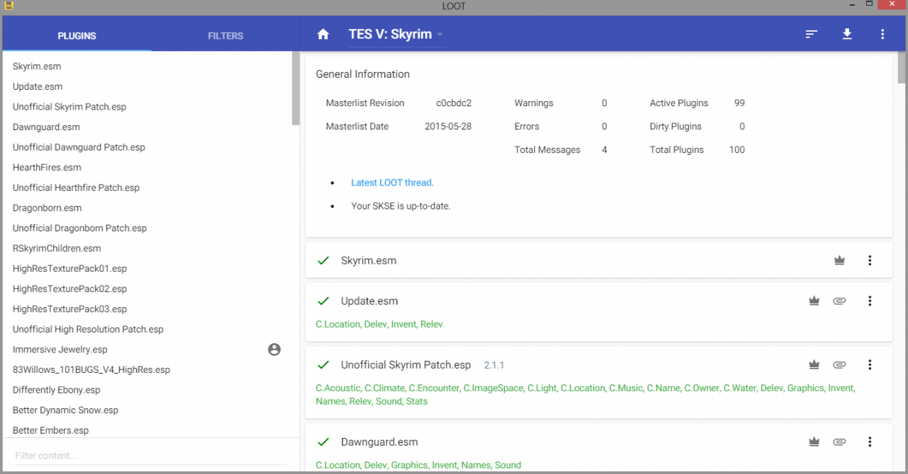
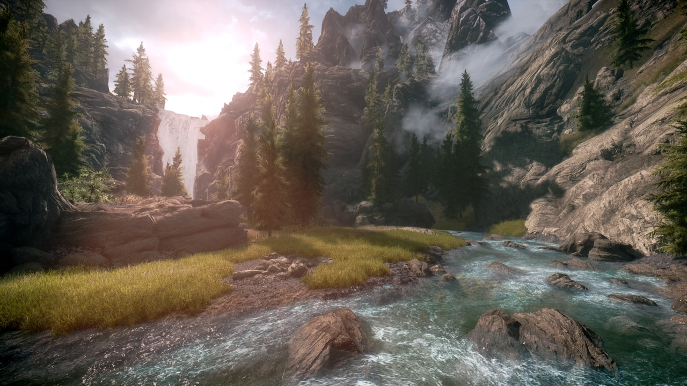
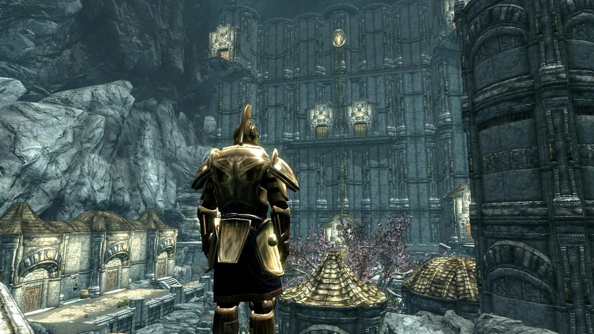
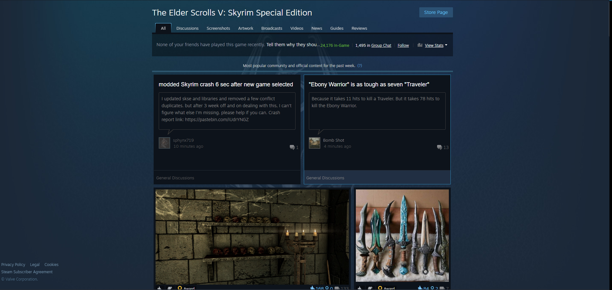

[Home](index.md) | [Manual Assessment Memo](manual_assessment_memo.md) | [Chatbot](chatbot.md) | [Procedure Video](procedure_video.md) | [Manual](manual.md) | [Reflective Blogs](reflective_blogs.md)

# Manual 

# Modding Skyrim: A (Mostly) Complete Guide

> 
>
> *Figure 1: Elder Scrolls V: Skyrim title screen, acquired from Nintendo Official Site*

## Table of Contents

- [Introduction](#introduction)
  - [Why mod Skyrim?](#why-mod-skyrim)
  - [What this manual covers - and what it doesn't](what-this-manual-covers---and-what-it-doesn't)
- [Preparing Your Game](#preparing-your-game)
  - [Choosing your Version](#choosing-your-version)
  - [Disabling Automatic Updates](#disabling-automatic-updates)
- [An Easy Start - Using Creations](#an-easy-start---using-creations)
  - [What are Creations?](#what-are-creations)
- [Understanding Mods](#understanding-mods)
  - [Where to Find Mods](#where-to-find-mods)
  - [Types of Mods](#types-of-mods)
  - [File Types](#file-types)
  - [A Word on Compatibility](#a-word-on-compatibility)
- [Tools for Modding](#tools-for-modding)
- [Installing Mods Safely](#installing-mods-safely)
  - [Set Up a Modding Profile](#step-1-set-up-a-modding-profile)
  - [Downloading Mods (The Right Way)](#step-2-downloading-mods-the-right-way)
  - [Installing Dependencies](#step-3-installing-dependencies)
  - [Avoiding Unsafe Mods](#step-4-avoiding-unsafe-mods)
  - [Test in Small Batches](#step-5-test-in-small-batches)
- [Load Order and Conflict Management](#load-order-and-conflict-management)
  - [What Is Load Order?](#what-is-load-order)
  - [Understanding Mod Priority vs. Plugin Order](#understanding-mod-priority-vs-plugin-order)
  - [Using LOOT to Sort Plugins](#using-loot-to-sort-plugins)
  - [Managing Conflicts](#managing-conflicts)
- [Graphics and Visual Overhauls](#graphics-and-visual-overhauls)
  - [What’s Possible with Visual Mods?](#whats-possible-with-visual-mods)
  - [Installing and Managing Graphics Mods](#installing-and-managing-graphics-mods)
  - [Popular Mods for Visual Overhauls](#popular-mods-for-visual-overhauls)
- [Enhancing Gameplay](#enhancing-gameplay)
  - [Core Gameplay Overhauls](#core-gameplay-overhauls)
  - [Quality of Life Mods](#quality-of-life-mods)
  - [Content Mods](#content-mods)
  - [Specialized Gameplay Mods](#specialized-gameplay-mods)
- [Troubleshooting and Fixing Common Issues](#troubleshooting-and-fixing-common-issues)
  - [General Troubleshooting Steps](#general-troubleshooting-steps)
  - [Common Issues and Fixes](#common-issues-and-fixes)
  - [Best Practices for Avoiding Problems](#best-practices-for-avoiding-problems)
- [Modding Etiquette and Community Tips](#modding-etiquette-and-community-tips)
  - [Respecting Mod Authors](#respecting-mod-authors)
  - [Participating in the Community](#participating-in-the-community)
- [Final Thoughts and Resources](#final-thoughts-and-resources)
  - [What You’ve Learned](#what-youve-learned)
  - [Recommended Resources](#recommended-resources)
  - [A Final Tip](#a-final-tip)

## Introduction

### Why mod Skyrim?

Welcome to the world of Skyrim modding—where your adventure never ends, and your imagination shapes the journey. Whether you’re new to the game or a seasoned Dragonborn, modding opens up a whole new dimension of possibilities. From breathtaking visual upgrades and combat overhauls to immersive quests and quality-of-life tweaks, mods allow you to tailor Skyrim into the game you wish it always was.

### What this manual covers

This manual is designed for players who want to dive deep into modding without touching the complexities of mod creation. You won’t need to write scripts or build your own dungeons—just follow along, and you’ll be installing and managing mods like a pro in no time. All you need is a bit of curiosity, some patience, and a love for the world of Tamriel.

This manual will walk you through setting up your game properly, using key tools, building a stable load order, and curating a personalized mod list for the best experience possible. Let’s turn vanilla Skyrim into something truly legendary.

## Preparing Your Game

Before installing your first mod, it's crucial to prepare your Skyrim installation properly—think of it as laying the foundation before building a house. Modding can push the game far beyond its original limits, so starting clean and organized is key to avoiding crashes, bugs, and performance headaches down the line.

### Choosing your version

First, decide which version of Skyrim you’ll be modding: The Special Edition (SE) or the Anniversary Edition (AE). SE is the most stable and widely supported by modern mods, while AE includes additional content that may cause compatibility issues unless you're careful with your mod setup. Most mods are dual supported by both version, but some are only supported by one, so picking one version is best.

### Disabling automatic updates

A fresh install with no lingering mods or saves is highly recommended. You’ll also want to disable automatic updates through Steam to avoid breaking your mod setup unexpectedly. It’s better to set everything up right the first time than to troubleshoot a messy modded game later. 

To disable automatic updates, navigate to your steam library, right click on the game title and click properties. In the open dialogue box click on the updates tab and select "Wait until I launch the game" from the dropdown menu. Unfortunately Steam does not offer a definitive way to turn off updates. To work around this you will need to use the update option we previously selected, and before launching the title, change your steam status to offline so that the launching isn't detected.

> 
>
> *Figure 2: Dialogue box where game specific settings can be changed, captured by Kira Discenza*

If this is too much of a hassle for you, feel free to skip this step. The benefit to this is that mods can be volatile when crossing release editions, and one update can possibly make half of your mods unusable.

Once your Skyrim installation is clean and stable, you’re ready to install the essential tools that will help manage your mods smoothly and safely.

# An Easy Start - Using Creations

If you’re interested in enhancing your Skyrim experience without diving headfirst into community modding, the Creation Club offers a simple, low-maintenance alternative. Included with the Anniversary Edition (or available for purchase separately in the Special Edition), these "Creations" are official, curated add-ons developed by Bethesda and selected community creators.

> 
> *Figure 3: Bethesda Creations home page, captured by Kira Discenza*

### What are Creations?

Creations include new quests, armor sets, weapons, spells, dungeons, and even game mechanics like fishing and survival mode. Unlike traditional mods, they integrate seamlessly with the game and require no special tools or mod managers—just enable or disable them in the game’s main menu. To access them, there is a button in the main menu of the game titled "Creations", located under the "New game" and "Load game" buttons that will take you to the Creations home page, pictured above.

While Creation Club content is more limited in scope than community mods, it’s a great way to freshen up your playthrough with minimal setup. It’s also fully supported by Bethesda, meaning it's unlikely to break your game or conflict with updates.

If you’re the type of player who just wants “a little something extra” without the overhead of learning modding tools, this is your perfect starting point. Later on, if you want more control or more ambitious changes, the rest of this manual will guide you into the world of full modding.

# Understanding Mods

Before diving into installation, it helps to understand what mods actually are and how they interact with Skyrim. At their core, mods are modifications—custom files made by the community that change, enhance, or add new content to the game. These can range from subtle quality-of-life tweaks to massive overhauls that transform gameplay entirely.

### Where to Find Mods

Most Skyrim mods are downloaded from [Nexus Mods](https://www.nexusmods.com/games/skyrim), though some are also hosted on platforms like GitHub or authors’ personal websites.

> 
>
> *Figure 4: Nexus mods home page, captured by Kira Discenza*

### Types of Mods

Mods generally fall into a few categories:

- Visual Mods improve the game's graphics through better textures, lighting, and effects.
- Gameplay Mods alter how the game plays—think combat mechanics, enemy AI, or survival systems.
- Content Mods add new quests, locations, followers, and sometimes even whole new worlds.
- Utility Mods don’t change the game directly but improve stability, performance, or user interface.

### File Types

When browsing mods, you’ll encounter various file formats:

- .esp (Elder Scrolls Plugin): Adds or changes game content
- .esm (Master file): Like an esp, but treated as a base layer
- .bsa (Bethesda Soft Archive): Contains textures, models, or audio

### A Word on Compatibility

Not all mods are compatible with the latest version of Skyrim—especially if you’re running the Anniversary Edition. Always read the mod’s description, requirements, and user comments before installing. Look out for version compatibility (e.g., “works with SKSE 2.2.3” or “AE patch required”).

Understanding these basics now will save you from hours of troubleshooting later. Up next, we’ll walk through the core tools you’ll need to safely install and manage your modded Skyrim.

The beauty of Skyrim modding is in mixing and matching these mods to create a customized experience—but that also means things can get messy fast without the right tools. That’s where we’re headed next.

# Tools for Modding

Modding Skyrim manually is possible, but not recommended. Why? Because without the right tools, managing hundreds of mods (and their dependencies, load order, and updates) turns into a chaotic mess. Luckily, the modding community has built some fantastic utilities to make the process smooth, stable, and organized.

Here are the essential tools every modder should install:

- [Mod Organizer 2 (MO2)](https://www.nexusmods.com/skyrimspecialedition/mods/6194) – The gold standard for mod management. MO2 uses a virtual file system, meaning it doesn’t alter your game files directly. You can easily enable/disable mods, create separate modding profiles, and keep your setup tidy. [Installation Guide](https://www.youtube.com/watch?v=07-JVWDn7LA).
- [LOOT (Load Order Optimization Tool)](https://loot.github.io/) – Ensures your mods are loaded in the correct order to avoid conflicts and crashes. LOOT automatically sorts your load order based on known mod interactions. [Installation Guide](https://loot.readthedocs.io/en/stable/app/installation.html).
- [SKSE (Skyrim Script Extender)](https://skse.silverlock.org/) – Required by many advanced mods, SKSE expands Skyrim’s scripting capabilities far beyond the base game. Essential for mods like SkyUI and most gameplay overhauls. [Installation Guide](https://www.youtube.com/watch?v=xTGnQIiNVqA).
- [SSEEdit](https://www.nexusmods.com/skyrimspecialedition/mods/164) – A powerful tool used to clean, inspect, and patch mods. It’s especially helpful for resolving conflicts between mods or making small custom tweaks. [Installation Guide](https://www.youtube.com/watch?v=HYRPx0hqaEE).

Don’t worry if some of these tools sound intimidating at first—we’ll walk through using them step-by-step in the following chapters. Once they’re set up, they’ll do most of the heavy lifting for you.

# Installing Mods Safely

Once your tools are in place, it’s time to start adding mods—but doing it the right way is crucial. Improper installation is one of the leading causes of broken saves, missing files, or game crashes. This section walks you through safe mod installation using Mod Organizer 2 (MO2), the standard for modern Skyrim modding.

### Step 1: Set Up a Modding Profile

MO2 lets you create different profiles, which are isolated mod setups. This is perfect for experimenting with new mod combinations or keeping playthroughs separate.

1. In MO2, click the gear icon and go to the Profiles tab.
2. Enable “Use profile-specific Game INI files”.
3. Create a new profile—name it something like “Base Setup” or “Vanilla + QoL”.

Each profile will have its own mod list and game settings, which helps avoid conflicts between setups.

### Step 2: Downloading Mods (The Right Way)

1. Visit Nexus Mods and log in.
2. Find a mod you want and click "Mod Manager Download" (MO2 will catch the file).
3. The mod will appear in MO2’s Downloads tab.
4. Once finished, right-click it and select “Install”.

After installation, the mod will appear in the left pane. Enable it by checking the box.

Tip: Always read the mod’s description. Look for installation instructions, required files, or load order recommendations. Some mods also include FOMOD installers (interactive menus that let you pick options), so follow prompts carefully.

### Step 3: Installing Dependencies

Some mods require others to work. These are called dependencies, and usually include tools like SKSE, frameworks like RaceMenu, or animation skeletons like XPMSSE.

MO2 will warn you if a required plugin is missing. Be sure to install dependencies before the mod that needs them, or you may get errors or crashes.

### Step 4: Avoiding Unsafe Mods

While most mods on Nexus are safe, a few red flags to watch for include:

- Mods with no documentation or vague descriptions
- Very old mods marked as outdated or incompatible
- Mods that replace .exe files or modify game DLLs (unless verified and popular)
- Script-heavy mods added mid-playthrough (these can break saves)

Always check the posts or bugs tab on Nexus to see if others are reporting problems.

### Step 5: Test in Small Batches

Avoid installing dozens of mods at once. Instead:

1. Install 3–5 mods.
2. Launch the game through MO2.
3. Start a new game or load a clean save and test functionality.
4. Confirm that the game boots, and the mods work as expected.

This makes it easier to identify the source of any issues. If something goes wrong, you’ll know which group of mods caused it.

# Load Order and Conflict Management

As you add more mods to your setup, keeping them properly ordered becomes essential. Even well-made mods can break your game if they load in the wrong sequence or conflict with each other. This section will teach you how to understand, manage, and resolve mod conflicts before they become serious issues.

### What Is Load Order?

Load order refers to the sequence in which Skyrim loads plugin files (.esp, .esm, and .esl) at startup. The order can determine:

- Which mod “wins” when two or more change the same object
- Whether a mod has access to the assets or data it needs
- How stable your game is during runtime

The wrong order can cause missing textures, invisible NPCs, broken quests, or crashes on launch.

### Understanding Mod Priority vs. Plugin Order

Mod Organizer 2 has two types of ordering:

- Left Pane (Mod Priority): Controls file overwrites—e.g., textures, meshes, scripts.
- Right Pane (Plugin Order): Controls plugin load order—e.g., quests, leveled lists, world edits.

Both orders matter, but plugins (right pane) are especially critical for gameplay mods. MO2 shows conflicts with icons and tooltips to help you identify overwrites or missing masters.

### Using LOOT to Sort Plugins

LOOT (Load Order Optimization Tool) takes the guesswork out of sorting plugins.

To use LOOT in MO2:

1. Add LOOT to MO2’s executable list.
2. Run LOOT from inside MO2.
3. Click “Sort Plugins” and apply the order it suggests.
4. Review any warnings about missing masters or outdated mods.

LOOT relies on a huge community-maintained database and is trusted by most modders.

> 
>
> *Figure 4: An open page of the LOOT tool, showing how the order of mods is organized, acquired from an [online skyrim forum](https://linustechtips.com/topic/377757-skyrim-load-order-optimization-tool-loot-updated-to-v070-now-with-added-blue/)*

### Managing Conflicts

MO2 flags conflicts with colored icons:

- Red lightning bolt – A file is being overwritten by another mod
- Green lightning bolt – This mod is overwriting another
- No icon – No conflict

Conflicts aren’t always bad—you want your texture replacer to overwrite vanilla files. But if two gameplay mods both change the same perk tree, you’ll need to choose which one “wins,” or merge them with a patch.

# Graphics & Visual Overhauls

One of the first things many Skyrim modders look to improve is the game’s graphics. From high-definition textures to full lighting overhauls, visual mods can make Skyrim look stunningly modern and immersive. However, adding too many graphics mods at once can also impact performance, so it’s essential to approach this section with balance and purpose.

### What’s Possible with Visual Mods?

Skyrim’s graphics can be transformed in many ways, and there’s a mod for almost every visual aspect of the game. These mods typically fall into the following categories:

- Texture Overhauls – Replaces vanilla textures for objects, landscapes, and characters with higher-quality versions. Common mods include Skyrim HD – 2K Textures and Noble Skyrim Mod HD-2K.
- Lighting and Weather – Mods like Relighting Skyrim and Vivid Weathers overhaul the game’s lighting to make it more realistic, adjusting everything from ambient light to shadow quality.
- ENB Presets – ENB (Enhanced Natural Beauty) mods allow you to install custom settings that change how Skyrim’s lighting, colors, and post-processing effects work. Popular ENBs like Rudy ENB can give the game a cinematic look, complete with better contrast, bloom effects, and realistic ambient lighting.
- Shadows and LOD – Mods like DynDOLOD and Static Mesh Improvement Mod (SMIM) improve shadows, distant object rendering, and the overall detail of Skyrim’s world.
- Character and Creature Models – Mods such as High Poly Head and Immersive Creatures replace Skyrim’s characters and enemies with higher-quality models.

### Installing and Managing Graphics Mods

When installing graphics mods, there are a few important things to keep in mind:

1. Texture Mod Installation:

   - Texture mods can be large, so make sure your system has enough resources (VRAM) to handle them.
   - Use LOOT to sort any texture mods that come with plugins (.esp files).
   - For texture-heavy mods like 4K packs, be mindful of your system's performance—too many high-res textures can lower your FPS.

2. ENB Installation:

   - ENBs require Skyrim Script Extender (SKSE) to run, so ensure you’ve installed SKSE64 properly first.
   - To install an ENB, download the preset and follow its installation instructions. Most ENBs have their own custom settings file that will tweak shaders, lighting, and effects.
   - After installation, launch the game using MO2 or a shortcut to your preferred ENB.

3. Load Order:

   - Load order matters for visual mods, especially if they modify textures or meshes. Texture replacers should generally be loaded last to overwrite lower-quality textures.

4. Performance Considerations:

   - Graphic-heavy mods (like ENBs or high-resolution textures) can stress your system, especially if you’re running a lot of them at once.

        Keep an eye on FPS and VRAM usage. Consider using Skyrim Performance Monitor to track performance in real-time.

        Dynamic Resolution Scaling mods like Upscale Texture Pack can help adjust visual quality based on your FPS.

> 
>
> *Figure 5: In-game Skyrim landscape with graphics mods on, acquired from the Steam workshop*

### Popular Mods for Visual Overhauls

  - Skyrim HD – 2K Textures – Replaces over 90% of Skyrim’s textures with 2K quality versions. A must-have for anyone wanting better visuals without a full overhaul.
  - Vivid Weathers – Overhauls Skyrim’s weather system and lighting, offering more variety and realism in the atmosphere.
  - Static Mesh Improvement Mod (SMIM) – Improves the 3D models of common objects in Skyrim (e.g., furniture, barrels, and windows), giving them a more polished look.
  - Rudy ENB – One of the most popular ENBs, with highly customizable settings that drastically improve Skyrim’s lighting and color grading.
  - Realistic Water Two – Replaces Skyrim’s water textures with more realistic, high-definition versions, also enhancing the flow and physics of water.

# Enhancing Gameplay

While visual mods are often the first place players start, the heart of modding Skyrim lies in enhancing its gameplay. Whether you want to tweak combat mechanics, add new quests, overhaul the economy, or completely change how the game feels, gameplay mods are the ones that truly transform your experience. This section highlights some of the best mods for altering the way Skyrim plays.

### Core Gameplay Overhauls

Mods that significantly change Skyrim's mechanics and difficulty.

- Requiem – The Roleplaying Overhaul: A complete rebalance of the game, making it tougher and more immersive.
- Ordinator – Perks of Skyrim: Overhauls the perk system with over 400 new perks.
- Ultimate Combat: Revamps combat with new animations, AI improvements, and more dynamic fights.
- Enderal: A full conversion mod that adds an entirely new world and storyline.

### Quality of Life Mods

Mods that improve usability and ease of play.

- SkyUI: A streamlined interface that improves inventory and UI management.
- Immersive Citizens – AI Overhaul: Enhances NPC behavior to make them more dynamic and realistic.
- Unofficial Skyrim Special Edition Patch: Fixes hundreds of bugs and issues left in the vanilla game.
- Relationship Dialogue Overhaul (RDO): Expands NPC interactions and follower dialogue.

### Content Mods

Mods that expand Skyrim’s world with new quests, locations, and factions.

- Falskaar: Adds a huge new land to explore with its own story and quests.
- The Forgotten City: A narrative-driven quest mod with multiple endings.
- Interesting NPCs: Adds over 250 fully voiced NPCs with new quests and stories.

> 
>
> *Figure 6: Screenshot from one of Skyrim's most successful mods, The Forgotten City, acquired from the Elder Scrolls wiki*

### Specialized Gameplay Mods

Mods that cater to specific playstyles or enhance certain aspects of the game.

- Survival Mode: Mods like Frostfall and iNeed add survival mechanics like hunger and cold.
- Thieves Guild and Dark Brotherhood Expansions: Mods like Thieves Guild Reborn expand these factions with new content.
- Combat Mods: TK Dodge and Vigor – Combat and Injuries enhance combat with new moves and injury mechanics.

To avoid conflicts, limit the number of heavy gameplay overhauls, and always check mod compatibility before installing multiple mods that modify core systems like combat or AI.

# Troubleshooting and Fixing Common Issues

Even with careful planning, modding Skyrim can occasionally lead to crashes, bugs, or strange behavior. This section will help you identify and fix common problems so you can get back to enjoying the game with minimal frustration.

### General Troubleshooting Steps

Before diving into specifics, follow these steps whenever something goes wrong:

- Check Mod Organizer 2 for Warnings: MO2 highlights missing masters, conflicts, and load order problems. Warnings in the right pane or missing file errors often point directly to the issue.
- Sort Load Order with LOOT: Use the LOOT tool to automatically sort your plugins (.esp/.esm/.esl) and resolve many compatibility problems.
- Disable Recently Added Mods: If the game was stable before a recent installation, try disabling the newest mods one by one to identify the culprit.
- Start a New Game: Some mods aren’t safe to add mid-playthrough, especially those that modify scripts, quests, or world spaces. Test issues on a new save first.

### Common Issues and Fixes

1. Game Won’t Launch or Crashes Instantly

   - Cause: Missing master files, incorrect SKSE installation, or broken plugin.
   - Fix: Check MO2’s “Data” tab for missing files. Ensure SKSE is installed correctly and that you're launching the game from MO2 or the SKSE executable.

2. Infinite Loading Screen

   - Cause: Heavy script load, mod conflicts, or broken save.
   - Fix: Try loading a clean save. Disable script-heavy mods temporarily. Use Resaver (Fallrim Tools) to clean broken scripts from saves.

3. Missing Textures or Purple Objects

   - Cause: Missing texture files or incorrect file paths.
   - Fix: Reinstall the mod. Ensure the texture files are present in the correct folder (textures/ under the mod’s directory in MO2).

4. “Black Face Bug” on NPCs

   - Cause: Mismatch between face textures and meshes from NPC overhaul mods.
   - Fix: Use the Face Discoloration Fix plugin in xEdit or regenerate face data using Creation Kit if needed.

5. Crashing When Entering a Specific Area

   - Cause: Worldspace mod conflict or corrupted cell.
   - Fix: Disable mods that affect the area. Use xEdit to check for overlapping changes to that location.
  
### Best Practices for Avoiding Problems

- Install Mods Slowly: Add a few mods at a time and test in-game before moving on.
- Keep Backups: Regularly back up your saves and MO2 profile so you can roll back if something breaks.
- Avoid Removing Mods Mid-Playthrough: Especially mods with scripts or quests—this can corrupt saves.
- Read Mod Pages: Authors often include important installation instructions, compatibility notes, or known issues.

# Modding Etiquette and Community Tips

Modding Skyrim isn’t just about installing files—it’s also about being part of a thriving community. Whether you're downloading your first mod or have a fully customized load order, following proper etiquette helps you get the most out of the experience while respecting the creators who make it all possible.

### Respecting Mod Authors

Mod creators pour hundreds (sometimes thousands) of hours into their work. Most do it for free, so it’s important to show respect:

- Always read the mod description before asking questions. Authors typically include installation instructions, compatibility notes, and FAQs.
- Avoid redistributing or modifying someone’s mod without permission. This includes uploading it elsewhere, repackaging it, or using assets in your own projects.
- Leave endorsements and kudos on sites like Nexus Mods if you enjoy a mod. It’s a simple way to show appreciation.
- Report issues respectfully. Don’t demand fixes—politely describe the bug, include your load order or crash logs, and be patient.

### Participating in the Community

Skyrim modding has a massive, helpful community. Getting involved can enhance your experience and keep you up-to-date with the latest tools and mods.

- Join forums and Discord servers for tools like Mod Organizer 2, xEdit, and specific mod authors. These are great places to get help or share advice.
- Don’t be afraid to ask questions, but search first. Many common problems have already been solved.
- Support mod authors via donations or Patreon if you’re able and feel like a mod has added real value to your game.

> 
>
> *Figure 7: The home page of the Skyrim Steam workshop page, acquired from the Steam workshop*

Skyrim’s modding scene has thrived for over a decade because of the passion and respect shared among its users and creators. By following good etiquette and staying involved, you contribute to a healthy, vibrant community—and get a better experience in return.

# Final Thoughts and Resources

Modding Skyrim can feel overwhelming at first—but once you get the hang of it, it becomes one of the most rewarding parts of playing the game. With the right tools and a thoughtful approach, you can shape Skyrim into exactly the experience you want, whether that's a deeply immersive RPG, a visually stunning fantasy world, or a survival sandbox full of challenge.

### What You’ve Learned

Throughout this manual, we’ve covered:

- The differences between Creation Club content and traditional mods
- How to set up your game safely using Mod Organizer 2
- Best practices for managing load order and mod conflicts
- Popular mods across visuals, gameplay, and immersion
- Tools for fixing common issues and maintaining stability
- Community etiquette and how to give back

You don’t have to install hundreds of mods to enjoy a better Skyrim. Even a few well-chosen additions can dramatically improve your experience. Start simple, build slowly, and have fun experimenting.

### Recommended Resources

Here are some reliable places to continue your modding journey:

- [Nexus Mods forums](https://forums.nexusmods.com/) – The largest Skyrim mod repository.
- Mod Organizer 2 GitHub – For official updates and documentation.
- [LOOT (Load Order Optimization Tool)](https://loot.github.io/) – Load order optimization.
- xEdit (SSEEdit) – For inspecting and cleaning plugins.
- [STEP (Skyrim Total Enhancement Project)](https://www.nexusmods.com/skyrim/mods/11) – Structured guides for stable modding.
- Wabbajack – Automated modlists for easy setup.
- [r/SkyrimMods](https://www.reddit.com/r/skyrimmods/) – Active Reddit community.
- YouTube channels like GamerPoets, Dirty Weasel Media, and Lexy's LOTD – Great for tutorials and guides.

### A Final Tip

Always mod with patience. Modding is not just a means to an end—it’s a hobby in itself. If you run into problems, don’t panic. Take a break, ask for help, and remember that every experienced modder started out not knowing the difference between an ESP and an ESL.

Thanks for reading—and happy modding!
