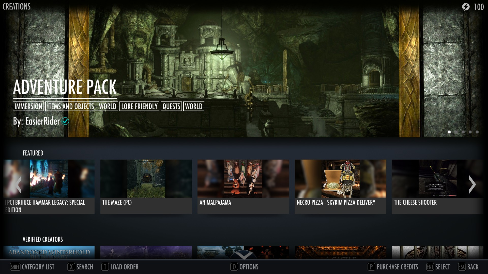

[Home](index.md) | [Manual Assessment Memo](manual_assessment_memo.md) | [Chatbot](chatbot.md) | [Procedure Video](procedure_video.md) | [Manual](manual.md) | [Reflective Blogs](reflective_blogs.md)

# Manual 

# Modding Skyrim: A (Mostly) Complete Guide

> 
>
> *Figure 1: Elder Scrolls V: Skyrim title screen*

## Table of Contents

- [Introduction](#introduction)
  - [Why mod Skyrim?](#why-mod-skyrim)
  - [What this manual covers - and what it doesn't](what-this-manual-covers---and-what-it-doesn't)
- [Preparing Your Game](#preparing-your-game)
  - [Choosing your Version](#choosing-your-version)
  - [Disabling Automatic Updates](#disabling-automatic-updates)
- [An Easy Start - Using Creations](#an-easy-start---using-creations)
  - [What are Creations?](#what-are-creations)
- [Understanding Mods](#understanding-mods)
  - [Where to Find Mods](#where-to-find-mods)
  - [Types of Mods](#types-of-mods)
  - [File Types](#file-types)
  - [A Word on Compatibility](#a-word-on-compatibility)
- [Tools for Modding](#tools-for-modding)

## Introduction

### Why mod Skyrim?

Welcome to the world of Skyrim modding—where your adventure never ends, and your imagination shapes the journey. Whether you’re new to the game or a seasoned Dragonborn, modding opens up a whole new dimension of possibilities. From breathtaking visual upgrades and combat overhauls to immersive quests and quality-of-life tweaks, mods allow you to tailor Skyrim into the game you wish it always was.

### What this manual covers

This manual is designed for players who want to dive deep into modding without touching the complexities of mod creation. You won’t need to write scripts or build your own dungeons—just follow along, and you’ll be installing and managing mods like a pro in no time. All you need is a bit of curiosity, some patience, and a love for the world of Tamriel.

This manual will walk you through setting up your game properly, using key tools, building a stable load order, and curating a personalized mod list for the best experience possible. Let’s turn vanilla Skyrim into something truly legendary.

## Preparing Your Game

Before installing your first mod, it's crucial to prepare your Skyrim installation properly—think of it as laying the foundation before building a house. Modding can push the game far beyond its original limits, so starting clean and organized is key to avoiding crashes, bugs, and performance headaches down the line.

### Choosing your version

First, decide which version of Skyrim you’ll be modding: The Special Edition (SE) or the Anniversary Edition (AE). SE is the most stable and widely supported by modern mods, while AE includes additional content that may cause compatibility issues unless you're careful with your mod setup. Most mods are dual supported by both version, but some are only supported by one, so picking one version is best.

### Disabling automatic updates

A fresh install with no lingering mods or saves is highly recommended. You’ll also want to disable automatic updates through Steam to avoid breaking your mod setup unexpectedly. It’s better to set everything up right the first time than to troubleshoot a messy modded game later. 

To disable automatic updates, navigate to your steam library, right click on the game title and click properties. In the open dialogue box click on the updates tab and select "Wait until I launch the game" from the dropdown menu. Unfortunately Steam does not offer a definitive way to turn off updates. To work around this you will need to use the update option we previously selected, and before launching the title, change your steam status to offline so that the launching isn't detected.

> 
>
> *Figure 2: Dialogue box where game specific settings can be changed, captured by Kira Discenza*

If this is too much of a hassle for you, feel free to skip this step. The benefit to this is that mods can be volatile when crossing release editions, and one update can possibly make half of your mods unusable.

Once your Skyrim installation is clean and stable, you’re ready to install the essential tools that will help manage your mods smoothly and safely.

# An Easy Start - Using Creations

If you’re interested in enhancing your Skyrim experience without diving headfirst into community modding, the Creation Club offers a simple, low-maintenance alternative. Included with the Anniversary Edition (or available for purchase separately in the Special Edition), these "Creations" are official, curated add-ons developed by Bethesda and selected community creators.

> 
> *Figure 3: Bethesda Creations home page, captured by Kira Discenza*

### What are Creations?

Creations include new quests, armor sets, weapons, spells, dungeons, and even game mechanics like fishing and survival mode. Unlike traditional mods, they integrate seamlessly with the game and require no special tools or mod managers—just enable or disable them in the game’s main menu. To access them, there is a button in the main menu of the game titled "Creations", located under the "New game" and "Load game" buttons that will take you to the Creations home page, pictured above.

While Creation Club content is more limited in scope than community mods, it’s a great way to freshen up your playthrough with minimal setup. It’s also fully supported by Bethesda, meaning it's unlikely to break your game or conflict with updates.

If you’re the type of player who just wants “a little something extra” without the overhead of learning modding tools, this is your perfect starting point. Later on, if you want more control or more ambitious changes, the rest of this manual will guide you into the world of full modding.

# Understanding Mods

Before diving into installation, it helps to understand what mods actually are and how they interact with Skyrim. At their core, mods are modifications—custom files made by the community that change, enhance, or add new content to the game. These can range from subtle quality-of-life tweaks to massive overhauls that transform gameplay entirely.

### Where to Find Mods

Most Skyrim mods are downloaded from [Nexus Mods](https://www.nexusmods.com/games/skyrim), though some are also hosted on platforms like GitHub or authors’ personal websites.

> 
>
> *Figure 4: Nexus mods home page, captured by Kira Discenza*

### Types of Mods

Mods generally fall into a few categories:

- Visual Mods improve the game's graphics through better textures, lighting, and effects.
- Gameplay Mods alter how the game plays—think combat mechanics, enemy AI, or survival systems.
- Content Mods add new quests, locations, followers, and sometimes even whole new worlds.
- Utility Mods don’t change the game directly but improve stability, performance, or user interface.

### File Types

When browsing mods, you’ll encounter various file formats:

- .esp (Elder Scrolls Plugin): Adds or changes game content
- .esm (Master file): Like an esp, but treated as a base layer
- .bsa (Bethesda Soft Archive): Contains textures, models, or audio

### A Word on Compatibility

Not all mods are compatible with the latest version of Skyrim—especially if you’re running the Anniversary Edition. Always read the mod’s description, requirements, and user comments before installing. Look out for version compatibility (e.g., “works with SKSE 2.2.3” or “AE patch required”).

Understanding these basics now will save you from hours of troubleshooting later. Up next, we’ll walk through the core tools you’ll need to safely install and manage your modded Skyrim.

The beauty of Skyrim modding is in mixing and matching these mods to create a customized experience—but that also means things can get messy fast without the right tools. That’s where we’re headed next.

# Tools for Modding

Modding Skyrim manually is possible, but not recommended. Why? Because without the right tools, managing hundreds of mods (and their dependencies, load order, and updates) turns into a chaotic mess. Luckily, the modding community has built some fantastic utilities to make the process smooth, stable, and organized.

Here are the essential tools every modder should install:

- [Mod Organizer 2 (MO2)](https://www.nexusmods.com/skyrimspecialedition/mods/6194) – The gold standard for mod management. MO2 uses a virtual file system, meaning it doesn’t alter your game files directly. You can easily enable/disable mods, create separate modding profiles, and keep your setup tidy.
- [LOOT (Load Order Optimization Tool)](https://loot.github.io/) – Ensures your mods are loaded in the correct order to avoid conflicts and crashes. LOOT automatically sorts your load order based on known mod interactions.
- [SKSE (Skyrim Script Extender)](https://skse.silverlock.org/) – Required by many advanced mods, SKSE expands Skyrim’s scripting capabilities far beyond the base game. Essential for mods like SkyUI and most gameplay overhauls.
- [SSEEdit](https://www.nexusmods.com/skyrimspecialedition/mods/164) – A powerful tool used to clean, inspect, and patch mods. It’s especially helpful for resolving conflicts between mods or making small custom tweaks.

Don’t worry if some of these tools sound intimidating at first—we’ll walk through using them step-by-step in the following chapters. Once they’re set up, they’ll do most of the heavy lifting for you.

#Installing Mods Safely

Once your tools are in place, it’s time to start adding mods—but doing it the right way is crucial. Improper installation is one of the leading causes of broken saves, missing files, or game crashes. This section walks you through safe mod installation using Mod Organizer 2 (MO2), the standard for modern Skyrim modding.

### Step 1: Set Up a Modding Profile

MO2 lets you create different profiles, which are isolated mod setups. This is perfect for experimenting with new mod combinations or keeping playthroughs separate.

1. In MO2, click the gear icon and go to the Profiles tab.
2. Enable “Use profile-specific Game INI files”.
3. Create a new profile—name it something like “Base Setup” or “Vanilla + QoL”.

Each profile will have its own mod list and game settings, which helps avoid conflicts between setups.

### Step 2: Downloading Mods (The Right Way)

1. Visit Nexus Mods and log in.
2. Find a mod you want and click "Mod Manager Download" (MO2 will catch the file).
3. The mod will appear in MO2’s Downloads tab.
4. Once finished, right-click it and select “Install”.

After installation, the mod will appear in the left pane. Enable it by checking the box.

Tip: Always read the mod’s description. Look for installation instructions, required files, or load order recommendations. Some mods also include FOMOD installers (interactive menus that let you pick options), so follow prompts carefully.

### Step 3: Installing Dependencies

Some mods require others to work. These are called dependencies, and usually include tools like SKSE, frameworks like RaceMenu, or animation skeletons like XPMSSE.

MO2 will warn you if a required plugin is missing. Be sure to install dependencies before the mod that needs them, or you may get errors or crashes.

### Step 4: Avoiding Unsafe Mods

While most mods on Nexus are safe, a few red flags to watch for include:

- Mods with no documentation or vague descriptions
- Very old mods marked as outdated or incompatible
- Mods that replace .exe files or modify game DLLs (unless verified and popular)
- Script-heavy mods added mid-playthrough (these can break saves)

Always check the posts or bugs tab on Nexus to see if others are reporting problems.

### Step 5: Test in Small Batches

Avoid installing dozens of mods at once. Instead:

1. Install 3–5 mods.
2. Launch the game through MO2.
3. Start a new game or load a clean save and test functionality.
4. Confirm that the game boots, and the mods work as expected.

This makes it easier to identify the source of any issues. If something goes wrong, you’ll know which group of mods caused it.
