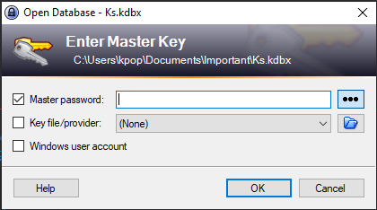
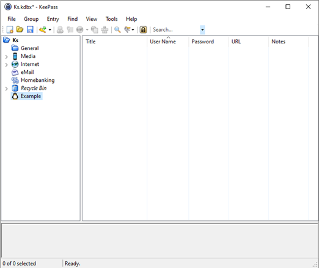
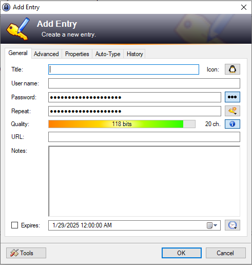

[Home](index.md) | [Manual Assessment Memo](manual_assessment_memo.md) | [Chatbot](chatbot.md) | [Procedure Video](procedure_video.md) | [Manual](manual.md) | [Reflective Blogs](reflective_blogs.md) 

# Table of Contents 
1. [Wayback Analysis](#wayback-analysis)
2. [Quick Start Guide](#quick-start-guide)
3. [Reflective Blog 3](#reflective-blog-3)
4. [Reflective Blog 4](#reflective-blog-4)
5. [Reflective Blog 6](#reflective-blog-6)
   
# Wayback Analysis

The website I chose to visit is fanfiction.net. While the current version of fanfiction.net isn’t the most modern, the snapshot I visited from 2004 has the telltale look of an early 2000s website. 
<http://web.archive.org/web/20040622183544/http://www.fanfiction.net/>

The first thing that struck me about the older version was the navigation. The novelty of the World Wide Web was still fresh at the time of many older website’s conception, I believe that because of this, functionality reigned, with less focus on design and streamlining. As the web progressed, more focus was put on convenience and ease of access. In 2004, Fanfiction lacked an intuitive menu navigation system that had me faltering on where to go when I was first looking at it. As a modern internet user, I’ve come to expect a clearly labeled and easily visible menu or tabs to navigate the site.

The other thing that caught my attention were the visuals of the website. I have always found that older websites are rather rough on the eyes, perhaps due to the fact that a lot of them, including fanfiction.net, consist chiefly of two things: text and hyperlinks. There is also the other end of the spectrum of old websites that crowds the eye with bright and numerous pictures and graphics. Websites now typically put a specific focus on visual interest, not just how many pictures and colors can fit on this page, but what will please the eye and draw people in to visit again. More thoughtfully placed graphics and dedicated color schemes make modern websites a more pleasant visual experience than that of older websites.

This assignment was completed without the help of AI technologies.

---
# Quick Start Guide

KeePass Password Manager

To begin using KeePass, first 

1.)	Go to the following link: <https://keepass.info/>

2.)	Select the latest version and click the link to the downloader at the top of the screen.

3.)   Select the desired file type for the download (.exe or .zip) and download installer.

4.)	Open the installer wizard and follow setup instructions.

5.)	Once installed, open the program and set a master password, seen in figure 1.

_Figure 1 shows the login screen of KeePass. (Image by Kira Discenza)_

 
6.)	The application should be open and functional now. Groups can be made to organize passwords more efficiently. Groups are displayed in the left-hand section of the window, shown in figure 2 below. There are several default groups to get you started, or they can be made by right clicking in the empty space of the section and selecting “Add Group”.

_Figure 2 shows the main window of KeyPass and groups to the left. (Image by Kira Discenza)_

 
7.)	To store your first password, either select the “Add Entry” button at the top of the window (denoted by a 🔑), press Ctrl+I, or right click in the right section of the window.

8.)	A default entry window should look like figure 3. Each entry starts with a default password randomly generated in the field, but can be changed or regenerated with several options.

_Figure 3 shows the entry creation screen. (Image by Kira Discenza)_

9.)	To generate a different random password, press the “Generate a Key” button (denoted by a 🔑) and select your desired password length.

10.)	To view the password in plaintext, select the ellipses (…) button.

11.)	Once your entry is filled out, select OK to add it to your password database.

12.)	Before exiting, select the save button (denoted by a 💾) in the top taskbar, and safely exit the application.

This assignment is free of synthetic text

---
# Reflective Blog 3

#### Prompt Q: Upload your resume (without your address, phone number, and email) to a generative AI tool of your choice (I suggest trying one in Boodlebox). Ask it what position you are best suited for, then ask it to revise your resume to make it more appealing to a future employer in your ideal field. Post: A summary of the suggested changes and a reflection. What did it do? What did you learn?

My resume was uploaded to ChatGPT, where the AI tool was prompted to generate the job that my resume would most closely match with, and asked to list ways to improve the document. The jobs that ChatGPT said matched my resume the most are below:

* IT Support Intern – Your customer service experience shows strong communication skills, and your TestOut IT Fundamentals Pro certification indicates a basic understanding of IT concepts.
* Help Desk Technician (Intern/Entry-Level) – Your mix of technical knowledge and customer service experience aligns well with help desk roles, where troubleshooting and assisting users are key.
* Junior Data Entry Specialist – Your experience with MySQL and Microsoft Office suggests you could handle data-related tasks.

When asked for suggestions on how to improve my resume, I was told to add relevant coursework I have completed in my studies, like "Networking Fundamentals" or "Database Management". Currently my resume is focused more on things I have done or specific programs I know, there isn't a lot of general skills, whether technical or soft. I think adding skills like this would help my resume a lot and show employers what I can offer. I was also suggested to add personal and academic projects related to IT, this suggestion wasn't very helpful since I don't have any projects like this under my belt, but it would be valuable if I did. The last suggestion that ChatGPT gave me was to add more certifications to my resume. Of course, any industry related certifications will help boost the strength of a resume, and I'm currently in the process of getting another certification so I can bolster my resume even more.

ChatGPT gave several good suggestions for improving my resume, some of which I will implement to hopefully help in my future job-finding endeavors.

This assignment was completed with the help of generative AI tool ChatGPT.

---

# Reflective Blog 4

#### Prompt E: Analyze a chatbot (e.g., customer service, virtual assistant). Spend at least 5 minutes interacting with it & exploring its functionality. Then, reflect on the bot's: purpose (What is the chatbot designed to do?, functionality (how well does it perform its tasks?), user experience (was it easy to use? What were the strengths and weaknesses?), and context (how does it benefit users and the organization?)

For this prompt I explored UCF's Knightbot, accessible at <https://www.sdes.ucf.edu/knightbot/>.

The purpose of the chatbot seems to be for answering basic FAQ's. It streamlines the process of students looking for answers about the school and keeps low-level questions from being directed towards real employees too much. The functionality is decent for what the product is, but because Knightbot is not generative, I found myself lacking a lot of real answers to the question I was asking. The bot only has about 1200 preprogrammed answers to question, basic things like "Where can I see my grades?" or "How do I know if I earned a school scholarship?" Anything more complex than this is answered with the name and link of a UCF office where you can ask for further help. Because free-typed questions usually weren't fruitful, Knightbot has a "prompt" feature where it prompts you with preprogrammed questions based on the contents of its message. This helps guide the user to questions the Knightbot can actually answer, but it doesn't solve the limit in the scope of help that Knightbot can provide.

It was generally easy to use due to it's simple interface and limited capabilities. I did grow frustrated at points using it because when the Knightbot response included prompt questions for you to click, it would not allow you to type a question, meaning you were forced to either pick a prompt or refresh the page. As stated before, the existence of Knightbot is useful for students with very basic questions. In such a large school, it can be hard to find or even know about certain resources. Knightbot is a decent method to remedy this, although I don't think I would say it's actual usability is much more advanced than an FAQ page.

This assignment was completed with the help of chatbot Knightbot.

# Reflective Blog 6

#### Prompt R: After you have completed the [Chatbot](blob/main/chatbot) assignment or any assignment using AI for most of the work, reflect on your interaction with this emerging technology: What does AI do well? What does it not do well? What did you have to correct or re-prompt it to modify? What can you know about its training data? What kinds of data was included? What kinds of data was excluded? What do you think the future holds as this technology is used and further advanced?

When creating my chatbot, I was surprised with how easy it was to get a functioning bot. The custom bot creator provided by Boodlebox was incredibly simple to use, and with surprisingly little effort on my part, already had the meat and potatoes of my chatbot after just a few instruction lines. Because the subject of my chatbot, a video game, with publicly available information, the AI was very good at acquiring information about it and answering questions before I imported any documents or additional information.

One thing I think it didn’t do as well as I hoped was having a unique personality. Despite multiple attempts to prompt it to deviate from its default personality, I could not easily change the way it responds to the user besides the pre-written introductory prompt. While this isn’t a huge problem, it would have been nice to maintain an air of immersion with the bot using a slightly brooding and mysterious personality to match the atmosphere of the game. I also had a small issue with the response formula, every response seemed to be the same, small snippet followed by one or more bullet lists. I didn’t love how many bullet lists the bot was using, so I tried different ways of customizing the bot instruction list, but since I didn’t want to bar the use of bullet points entirely it was hard to instruct the bot. In the end I wasn’t able to really change my bot responses. 

Overall I was pleased with the AI’s ability to make the task of creating a chatbot so simple, but unimpressed with the lack of flexibility in the bot. The bot seemed to be trained to be a certain way: professional and easy to digest. While of course these things are important, it makes molding the bot to be different than that difficult.
